<h2>EfficientNet-EfficientNet-Gastric-Carcinoma (Updated: 2022/11/11)</h2>
<a href="#1">1 EfficientNetV2 Gastric Carcinoma Classification </a> 
<a href="#1.1">1.1 Clone repository</a> 
<a href="#1.2">1.2 Prepare Gastric Carcinoma dataset</a> 
<a href="#1.3">1.3 Install Python packages</a> 
<a href="#2">2 Python classes for Gastric Carcinoma Classification</a> 
<a href="#3">3 Pretrained model</a> 
<a href="#4">4 Train</a> 
<a href="#4.1">4.1 Train script</a> 
<a href="#4.2">4.2 Training result</a> 
<a href="#5">5 Inference</a> 
<a href="#5.1">5.1 Inference script</a> 
<a href="#5.2">5.2 Sample test images</a> 
<a href="#5.3">5.3 Inference result</a> 
<a href="#6">6 Evaluation</a> 
<a href="#6.1">6.1 Evaluation script</a> 
<a href="#6.2">6.2 Evaluation result</a> 

<h2>
<a id="1">1 EfficientNetV2 Gastric Carcinoma Classification</a>
</h2>

 This is an experimental EfficientNetV2 Gastric Carcinoma Classification project based on <b>efficientnetv2</b> in <a href="https://github.com/google/automl">Brain AutoML</a>.
 

This image dataset used here has been taken from the following website: 
<a href="https://www.kaggle.com/datasets/wangtyi/seedgastric-carcinoma-dataset">SEED-gastric-carcinoma-dataset</a>
 
 
 We use python 3.8 and tensorflow 2.8.0 environment on Windows 11. 
 

<h3>
<a id="1.1">1.1 Clone repository</a>
</h3>
 Please run the following command in your working directory: 
<pre>
git clone https://github.com/atlan-antillia/EfficientNet-Gastric-Carcinoma.git
</pre>
You will have the following directory tree: 
<pre>
.
├─asset
└─projects
    └─Gastric-Carcinoma
        ├─eval
        ├─evaluation
        ├─inference
        ├─models
        ├─Gastric-Carcinoma-Images
        └─test
</pre>
<h3>
<a id="1.2">1.2 Prepare Gastric Carcinoma dataset</a>
</h3>

Please download the dataset <b>SEED-gastric-carcinoma-dataset</b> from the following web site: 
https://www.kaggle.com/datasets/wangtyi/seedgastric-carcinoma-dataset
 
The  <b>2_preprocessed_data</b> dataset contains the stage1 and stage2 directories and a train.csv file.
<pre>
2_preprocessed_data
├─train.csv
├─stage1
│  ├─p_image
│  └─p_mask
└─stage2
    ├─p_image
    └─p_mask
</pre>
 
 

1.We have created <b>Image-dataset-master</b> by using <a href="./projects/Gastric-carcinoma/DatasetCategorizer.py">DatasetCategorizer.py</a> and 
<a href="./projects/Gastric-carcinoma/train.csv">train.csv</a> file which specifies a category for each image 
in the <b>stage1/p_image</b> and <b>stage2/p_image</b> directories,
. 
<pre>
Image-dataset-master
  ├─category_0
  ├─category_1
  └─category_2
</pre>

2. We have create <b>Gastric-carcinoma-Images</b> dataset from <b>mage-dataset-master</b> by using <a 
href="./projects/Gastric-carcinoma/split_master.py">split_master.py</a>.
 

<pre>
Gastric-Carcinoma-Images
├─test
│  ├─category_0
│  ├─category_1
│  └─category_2
└─train
    ├─category_0
    ├─category_1
    └─category_2
</pre>

The number of images in the dataset is the following: 
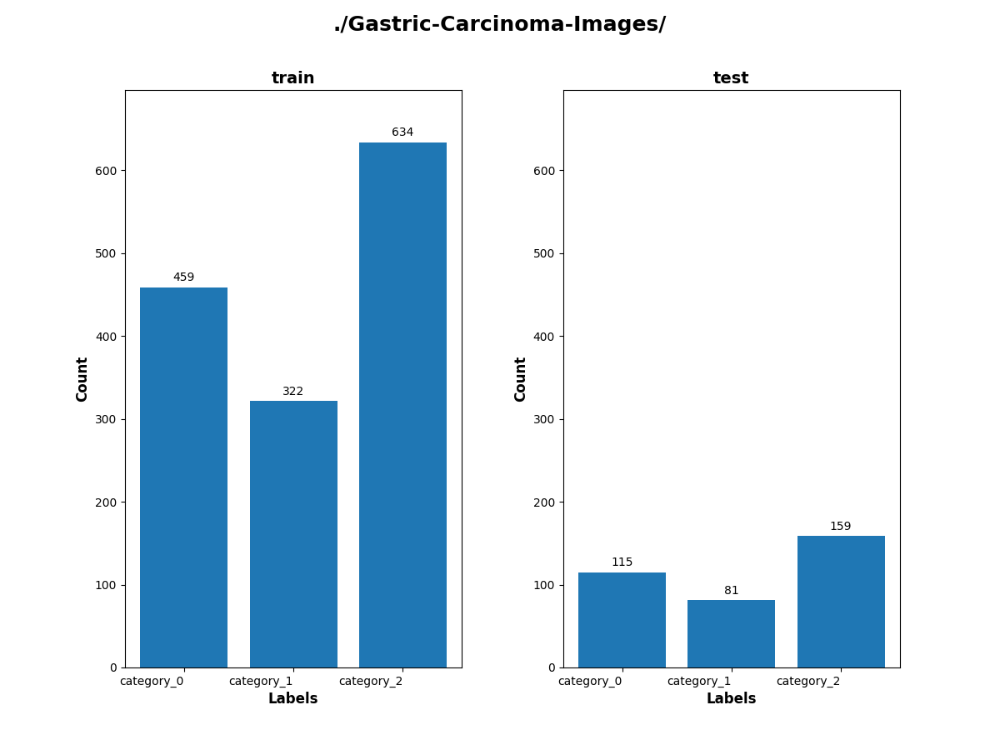 
 

Gastric_Carcinoma_Images/train/category_0: 
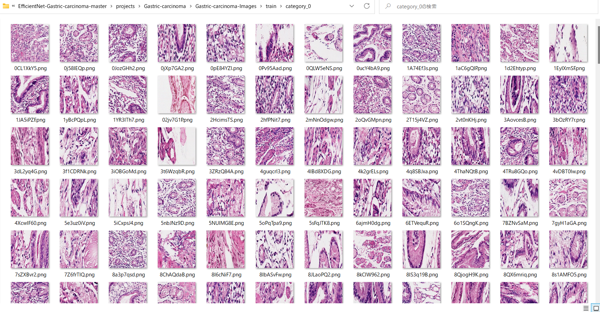
 
 
Gastric_Carcinoma_Images/train/category_1: 
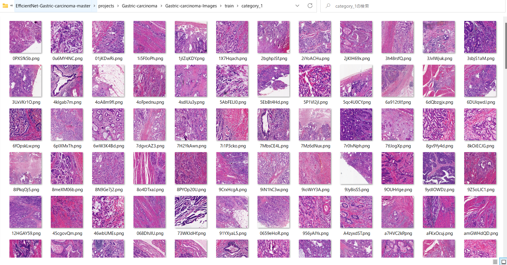
 
 
Gastric_Carcinoma_Images/train/category_2: 
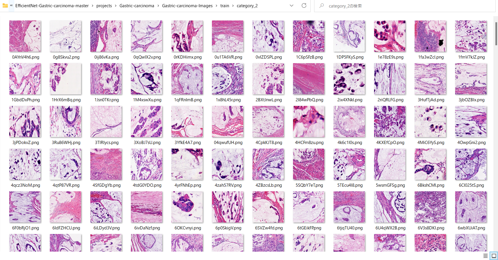
 

<h3>
<a id="#1.3">1.3 Install Python packages</a>
</h3>
Please run the following commnad to install Python packages for this project. 
<pre>
pip install -r requirements.txt
</pre>
 

<h2>
<a id="2">2 Python classes for Gastric Carcinoma Classification</a>
</h2>
We have defined the following python classes to implement our Kidney Disease Classification. 
<li>
<a href="./ClassificationReportWriter.py">ClassificationReportWriter</a>
</li>
<li>
<a href="./ConfusionMatrix.py">ConfusionMatrix</a>
</li>
<li>
<a href="./CustomDataset.py">CustomDataset</a>
</li>
<li>
<a href="./EpochChangeCallback.py">EpochChangeCallback</a>
</li>
<li>
<a href="./EfficientNetV2Evaluator.py">EfficientNetV2Evaluator</a>
</li>
<li>
<a href="./EfficientNetV2Inferencer.py">EfficientNetV2Inferencer</a>
</li>
<li>
<a href="./EfficientNetV2ModelTrainer.py">EfficientNetV2ModelTrainer</a>
</li>
<li>
<a href="./FineTuningModel.py">FineTuningModel</a>
</li>

<li>
<a href="./TestDataset.py">TestDataset</a>
</li>

<h2>
<a id="3">3 Pretrained model</a>
</h2>
 We have used pretrained <b>efficientnetv2-m</b> model to train Gastric Carcinoma Classification FineTuning Model.
Please download the pretrained checkpoint file from <a href="https://storage.googleapis.com/cloud-tpu-checkpoints/efficientnet/v2/efficientnetv2-m.tgz">efficientnetv2-m.tgz</a>, expand it, and place the model under our top repository.

<pre>
.
├─asset
├─efficientnetv2-m
└─projects
    └─Gastric-Carcinoma
  ...
</pre>

<h2>
<a id="4">4 Train</a>

</h2>
<h3>
<a id="4.1">4.1 Train script</a>
</h3>
Please run the following bat file to train our Kidney Disease Classification efficientnetv2 model by using
<a href="./projects/Gastric-Carcinoma/Gastric-Carcinoma-Images/train">Gastric-Carcinoma-Images/train</a>.
<pre>
./1_train.bat
</pre>
<pre>
rem 1_train.bat
python ../../EfficientNetV2ModelTrainer.py ^
  --model_dir=./models ^
  --eval_dir=./eval ^
  --model_name=efficientnetv2-m  ^
  --data_generator_config=./data_generator.config ^
  --ckpt_dir=../../efficientnetv2-m/model ^
  --optimizer=rmsprop ^
  --image_size=384 ^
  --eval_image_size=480 ^
  --data_dir=./Gastric-Carcinoma-Images/train ^
  --data_augmentation=True ^
  --valid_data_augmentation=True ^
  --fine_tuning=True ^
  --monitor=val_loss ^
  --learning_rate=0.0001 ^
  --trainable_layers_ratio=0.4 ^
  --dropout_rate=0.4 ^
  --num_epochs=100 ^
  --batch_size=4 ^
  --patience=10 ^
  --debug=True 
</pre>

, where data_generator.config is the following: 
<pre>
; data_generation.config

[training]
validation_split   = 0.2
featurewise_center = Fale
samplewise_center  = False
featurewise_std_normalization=True
samplewise_std_normalization =False
zca_whitening                =False
rotation_range     = 90
horizontal_flip    = True
vertical_flip      = True
width_shift_range  = 0.1
height_shift_range = 0.1
shear_range        = 0.01
zoom_range         = [0.6, 1.4]
data_format        = "channels_last"

[validation]
validation_split   = 0.2
featurewise_center = False
samplewise_center  = False
featurewise_std_normalization=True
samplewise_std_normalization =False
zca_whitening                =False
rotation_range     = 90
horizontal_flip    = True
vertical_flip      = True
width_shift_range  = 0.1
height_shift_range = 0.1
shear_range        = 0.01
zoom_range         = [0.6, 1.4]
data_format        = "channels_last"
</pre>

<h3>
<a id="4.2">4.2 Training result</a>
</h3>

This will generate a <b>best_model.h5</b> in the models folder specified by --model_dir parameter. 
Furthermore, it will generate a <a href="./projects/Gastric-Carcinoma/eval/train_accuracies.csv">train_accuracies</a>
and <a href="./projects/Gastric-Carcinoma/eval/train_losses.csv">train_losses</a> files
 
Training console output: 
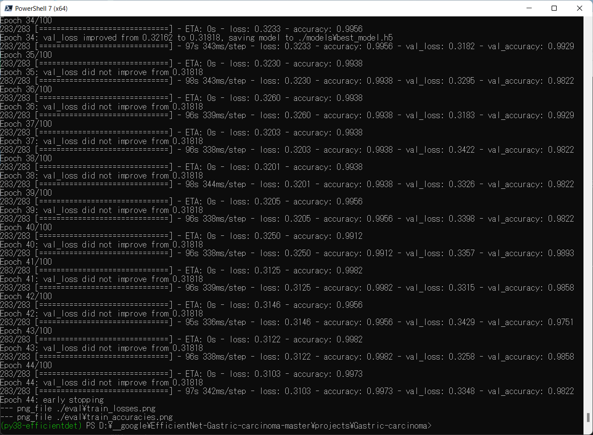 
 
Train_accuracies: 
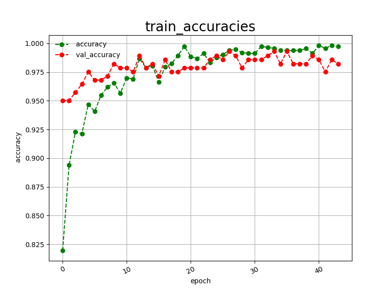 

 
Train_losses: 
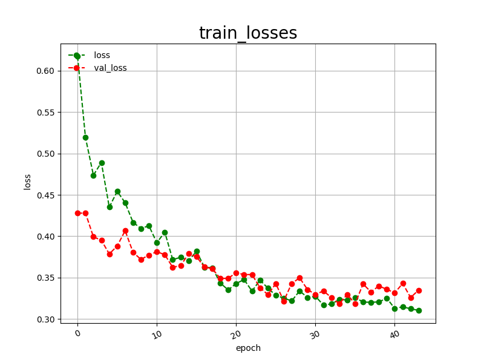 

 
<h2>
<a id="5">5 Inference</a>
</h2>
<h3>
<a id="5.1">5.1 Inference script</a>
</h3>
Please run the following bat file to infer the breast cancer in test images by the model generated by the above train command. 
<pre>
./2_inference.bat
</pre>
<pre>
python ../../EfficientNetV2Inferencer.py ^
  --model_name=efficientnetv2-m  ^
  --model_dir=./models ^
  --fine_tuning=True ^
  --trainable_layers_ratio=0.4 ^
  --dropout_rate=0.4 ^
  --image_path=./test/*.png ^
  --eval_image_size=480 ^
  --label_map=./label_map.txt ^
  --mixed_precision=True ^
  --infer_dir=./inference ^
  --debug=False 
</pre>
 
label_map.txt:
<pre>
category_0
category_1
category_2
</pre>
 
<h3>
<a id="5.2">5.2 Sample test images</a>
</h3>

Sample test images generated by <a href="./projects/Gastric-Carcinoma/create_test_dataset.py">create_test_dataset.py</a> 
from <a href="./projects/Gastric-Carcinoma/Gastric-Carcinoma-Images/test">/Gastric-Carcinoma-Images/test</a>.
 
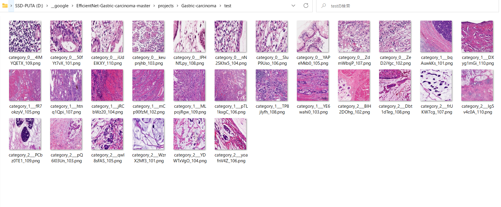 

<h3>
<a id="5.3">5.3 Inference result</a>
</h3>
This inference command will generate <a href="./projects/Gastric-Carcinoma/inference/inference.csv">inference result file</a>.
 
 
Inference console output: 
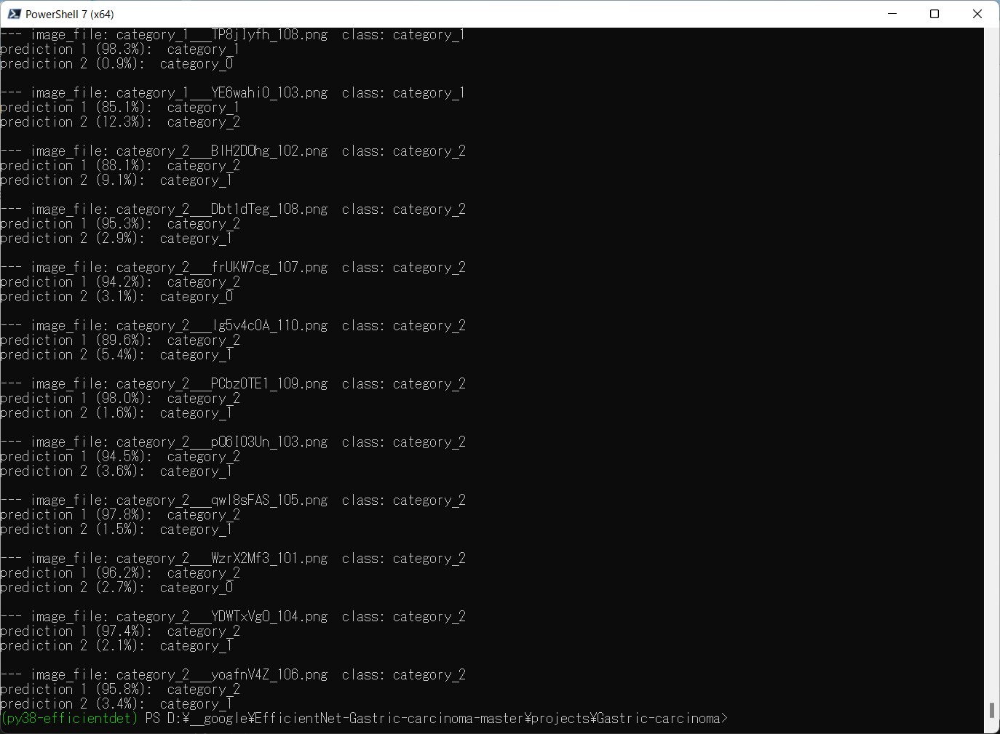 
 

Inference result (inference.csv): 
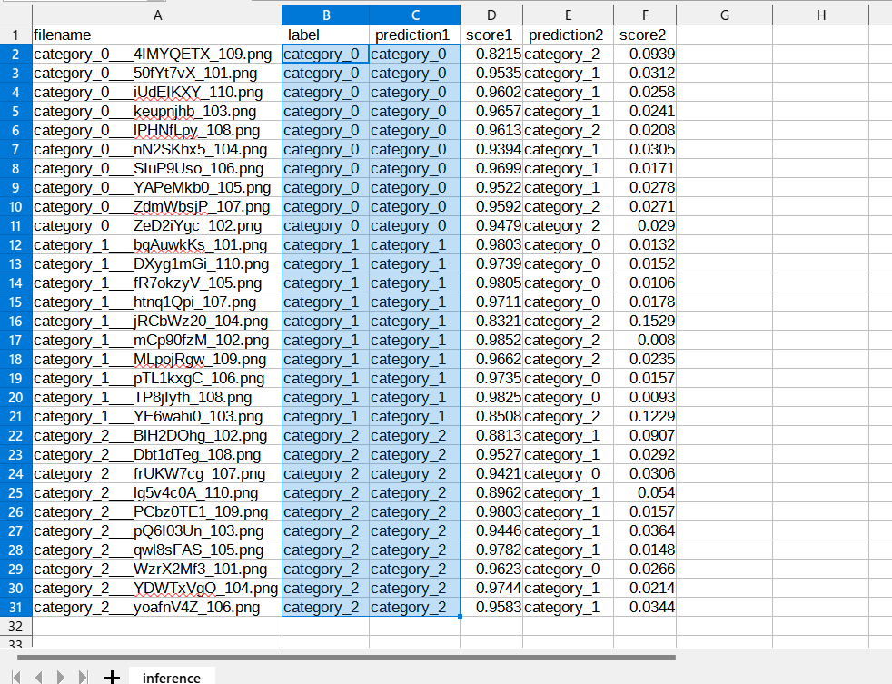 
 
<h2>
<a id="6">6 Evaluation</a>
</h2>
<h3>
<a id="6.1">6.1 Evaluation script</a>
</h3>
Please run the following bat file to evaluate <a href="./projects/Gastric-Carcinoma/Gastric-Carcinoma-Images/test">
Gastric-Carcinoma-Images/test/test</a> by the trained model. 
<pre>
./3_evaluate.bat
</pre>
<pre>
rem 3_evaluate.bat
python ../../EfficientNetV2Evaluator.py ^
  --model_name=efficientnetv2-m  ^
  --model_dir=./models ^
  --data_dir=./Gastric-Carcinoma-Images/test ^
  --evaluation_dir=./evaluation ^
  --fine_tuning=True ^
  --trainable_layers_ratio=0.4 ^
  --dropout_rate=0.4 ^
  --eval_image_size=480 ^
  --mixed_precision=True ^
  --debug=False 
</pre>
 

<h3>
<a id="6.2">6.2 Evaluation result</a>
</h3>

This evaluation command will generate <a href="./projects/Gastric-Carcinoma/evaluation/classification_report.csv">a classification report</a>
 and <a href="./projects/Gastric-Carcinoma/evaluation/confusion_matrix.png">a confusion_matrix</a>.
 
 
Evaluation console output: 
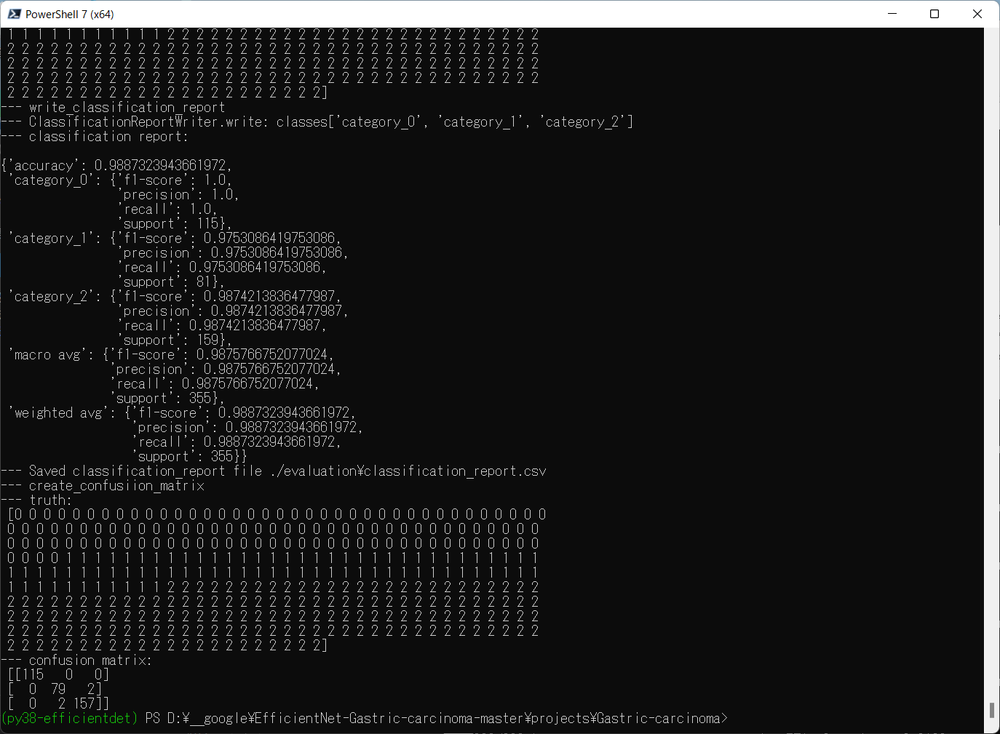 
 

 
Classification report: 
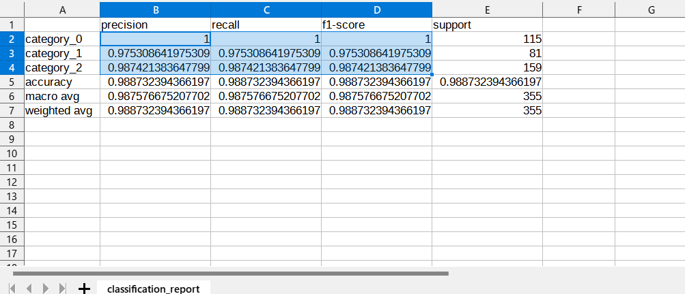 

 
Confusion matrix: 
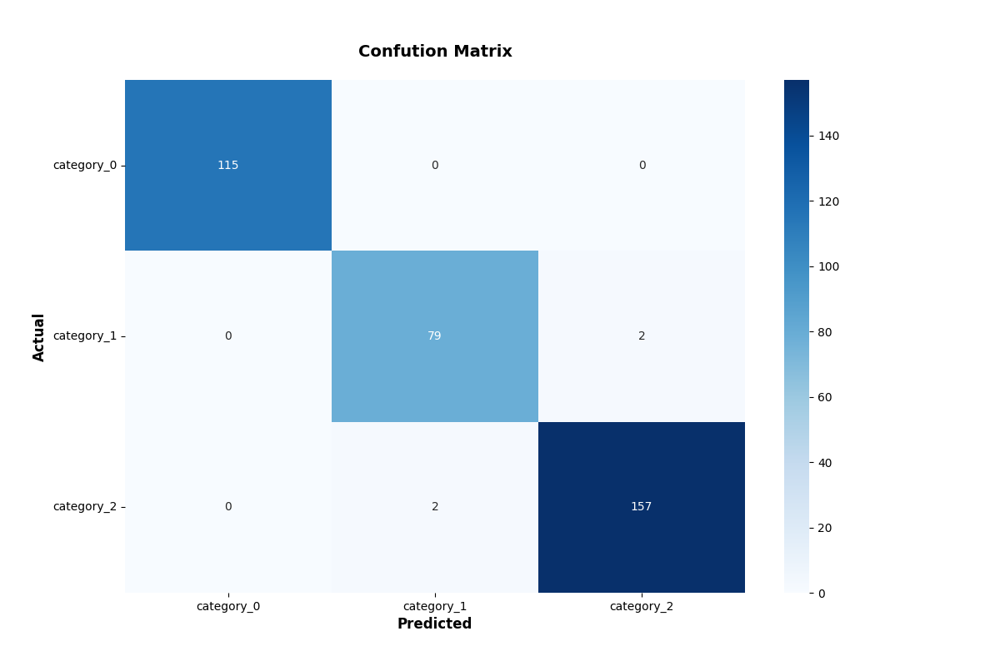 

 
<h3>
References
</h3>
<b>1. SEED-gastric-carcinoma-dataset</b> 
<pre>
https://www.kaggle.com/datasets/wangtyi/seedgastric-carcinoma-dataset</b> 
</pre>

<b>2. Identification of gastric cancer with convolutional neural networks: a systematic review</b> 

Yuxue Zhao, Bo Hu, Ying Wang, Xiaomeng Yin, Yuanyuan Jiang & Xiuli Zhu

<pre>
https://link.springer.com/article/10.1007/s11042-022-12258-8
</pre>

<b>3. Convolutional neural network-based system for endocytoscopic diagnosis of early gastric cancer</b> 

Hiroto Noda, Mitsuru Kaise, Kazutoshi Higuchi, Eriko Koizumi, Keiichiro Yoshikata, Tsugumi Habu, Kumiko Kirita, Takeshi Onda, 
Jun Omori, Teppei Akimoto, Osamu Goto, Katsuhiko Iwakiri & Tomohiro Tada 

<pre>
https://bmcgastroenterol.biomedcentral.com/articles/10.1186/s12876-022-02312-y
</pre>

<b>4. Deep Learning Models for Histopathological Classification of Gastric and Colonic Epithelial Tumours </b> 

Osamu Iizuka, Fahdi Kanavati, Kei Kato, Michael Rambeau, Koji Arihiro & Masayuki Tsuneki

<pre>
https://www.nature.com/articles/s41598-020-58467-9
</pre>

